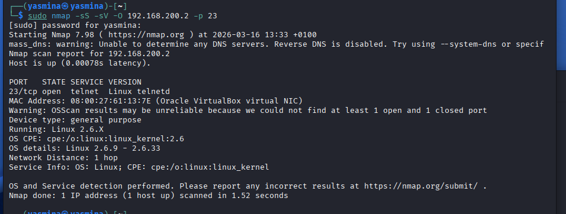
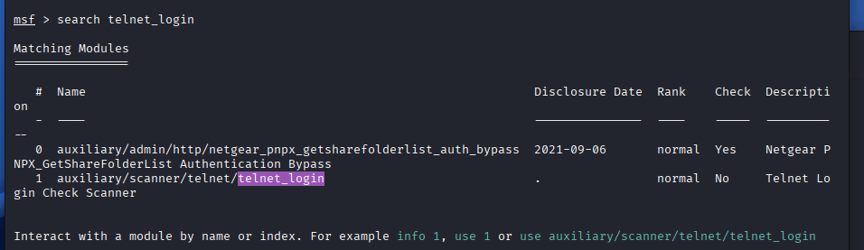
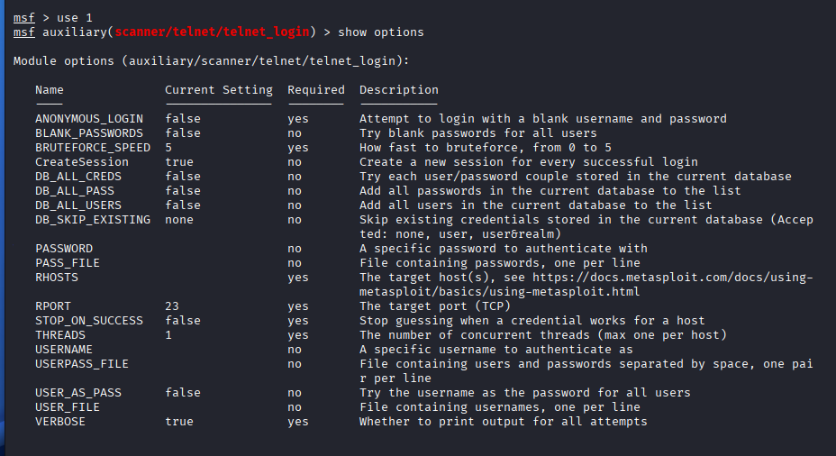
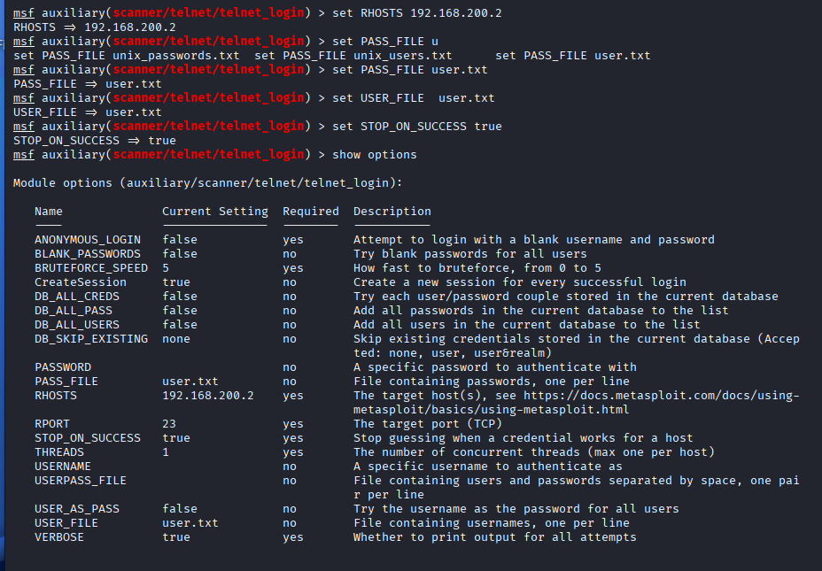
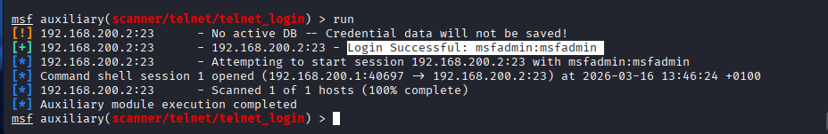
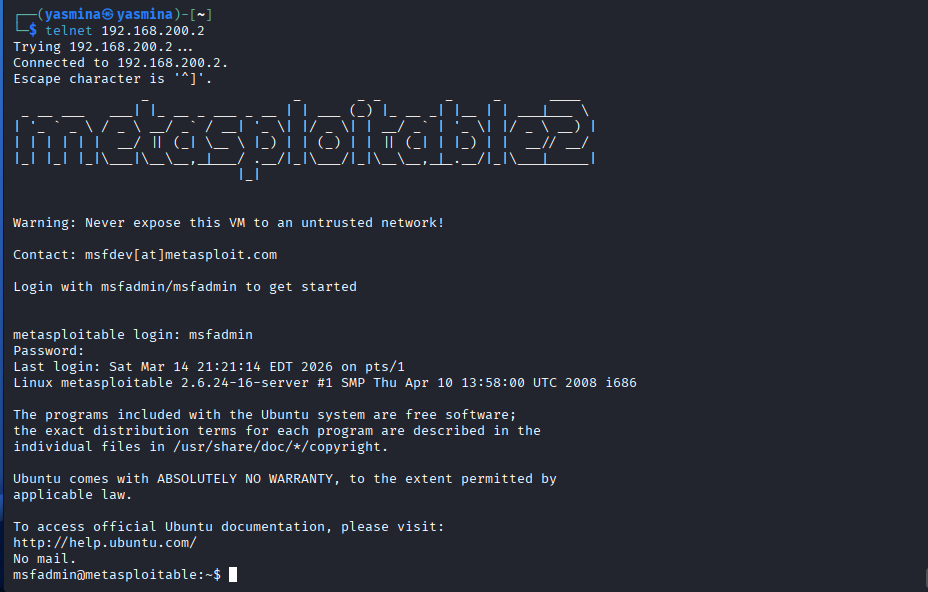

# Exploitation faille telnet 23

Donc là on va étudier le port 23 et le protocole telnet.

On va d'abord expliquer ce que c'est comme d'habitude. Telnet est un
protocole de connexion distante. C'est un peu l'ancêtre de SSH. La
différence est que SSH est chiffré alors que telnet ne l'est pas du
tout. Tout passe en clair sur le réseau.

C'est ce qui le rend vulnérable, parce qu'un attaquant peut voir
directement le login et le mot de passe qui circulent sur le réseau. En
plus il est souvent configuré avec des mots de passe par défaut.

Avec ce type de vulnérabilité on peut assez facilement obtenir un shell
complet sur la machine. Une fois connecté on peut lire les fichiers ou
exécuter des commandes.

La seule chose à faire est donc de trouver le login et le mot de passe
de la machine cible. Pour cela on va procéder par brute force.

------------------------------------------------------------------------

## Scan du port

On commence toujours par scanner la machine cible avec nmap en précisant
le port concerné, ici le port 23.

On peut repérer le service telnet et la version du logiciel telnetd.

------------------------------------------------------------------------

## Recherche dans metasploit

Ensuite on lance metasploit avec :

msfconsole

Puis on fait une recherche sur telnet_login.

On cherche telnet_login parce que quand on se connecte en telnet avec la
commande :

telnet IP_CIBLE

Le système nous demande directement un login et un mot de passe.

Donc le module telnet_login va tester automatiquement plusieurs
combinaisons.

------------------------------------------------------------------------

## Utilisation du module

On sélectionne le module puis on regarde les options.

Ensuite on tape show options.

On doit renseigner les informations manquantes.

On renseigne :

RHOSTS avec l'adresse IP de la cible.

Puis on va récupérer des listes dans :

/usr/share/metasploit-framework/data/wordlists/

On peut utiliser :

unix_passwords.txt pour les mots de passe\
et une liste d'utilisateurs pour USER_FILE

On renseigne donc :

PASS_FILE\
USER_FILE

On met aussi :

STOP_ON_SUCCESS = true

Cela permet d'arrêter le scan dès qu'un mot de passe fonctionne.

Dans cet exemple, pour aller plus vite, j'ai créé une liste avec un seul
mot de passe. Mais normalement on utilise des listes beaucoup plus
longues.

Plus il y a de mots dans la liste, plus le brute force va prendre du
temps.

------------------------------------------------------------------------

## Lancement du brute force

Ensuite on lance le module avec :

run

Le module va tester les combinaisons login / mot de passe jusqu'à
trouver la bonne.

Il suffit d'attendre que le bon résultat apparaisse.

------------------------------------------------------------------------

## Connexion à la machine

Une fois que le login et le mot de passe ont été trouvés, on peut ouvrir
un nouveau terminal.

Puis on tape :

telnet 192.168.200.2

Le système demande le login et le mot de passe.

On entre les informations trouvées avec le brute force.

Normalement on doit pouvoir se connecter.

Le test final est réussi et on obtient l'accès à la machine.
