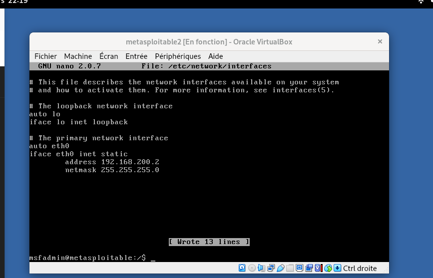

# Projet numéro deux preparation des machines

Donc pour ce deuxième projet, j’ai installé une machine qu’on appelle metasploit de type Cali Linux + une machine méta exploitable.

Donc je vais d’abord expliquer ce que c’est rapidement.

Metasploit c’est quoi ? C’est en fait un framework, donc un ensemble, qui sert à exploiter et surtout à la collecte d’informations. 
On va utiliser msfconsole pour lancer des attaques, scanner le réseau etc. donc on va du coup exploiter les vulnérabilité (les failles dans le système).
 Donc l’exploit de Metasploit c’est quoi ? c’est le code qui permet d’exploiter la vulnérabilité. Et une fois qu’on sera entré, on utilisera ce qu’on appelle le payload. Le payload c’est quoi ? 
 c’est le code exécuté par le système sur la machine victime après l’exploitation.

Cette console permet de :

- rechercher des exploits
- configurer une attaque
- exploiter une vulnérabilité

Quelques notions importantes dans Metasploit :

| Élément | Explication |
|---|---|
| exploit | code qui permet d’exploiter une vulnérabilité |
| payload | code exécuté sur la machine victime après l’exploitation |
| vulnérabilité | faille dans un système ou un logiciel |

Une fois que l’exploit permet d’entrer dans le système, le payload est le code exécuté sur la machine cible.

## Metasploitable

La machine Metasploitable c’est la machine victime.

C’est une machine utilisée pour l’apprentissage de la cybersécurité. Elle contient volontairement des vulnérabilités pour pouvoir s’entraîner à réaliser des attaques et comprendre comment elles fonctionnent.

Le but est donc d’utiliser Kali Linux pour attaquer cette machine et exploiter ses failles.

## Mise en place du réseau

Donc on va isoler les deux machines sur un seul réseau. On va créer du coup un réseau qui s’appelle LAN3.

Les deux machines vont recevoir une adresse IP statique dans le réseau suivant :

192.168.200.0

Configuration utilisée :

| Machine | Adresse IP |
|---|---|
| Kali Linux | 192.168.200.1 |
| Metasploitable | 192.168.200.2 |

Je passe volontairement rapidement la configuration complète des machines car il existe déjà beaucoup de tutoriels sur Internet.

L’objectif ici est plutôt de se concentrer sur les commandes importantes pour débuter en cybersécurité et comprendre les étapes d’une attaque.

## Configuration de l'adresse IP sur Kali Linux

Sur Kali Linux j’ai configuré l’adresse IP via le terminal en utilisant Network Manager.

Commande utilisée :

nmcli

nmcli signifie :

Network Manager Command Line Interface

Exemple de commande utilisée pour configurer l’adresse IP :

sudo nmcli con mod "Wired connection 1" ipv4.addresses 192.168.200.1/24

Explication rapide :

- sudo : exécuter la commande en administrateur
- nmcli : outil de configuration réseau
- con : connexion
- mod : modifier
- ipv4.addresses : définir l’adresse IP

Il est aussi possible de configurer l’adresse IP via l’interface graphique, mais j’ai préféré utiliser le terminal.

Je vais essayer de faire la plupart des commandes en ligne de commande pour m’entraîner.

## Configuration de la machine Metasploitable

La machine Metasploitable est très simple.

Elle fonctionne uniquement avec un terminal et est volontairement vulnérable.

Elle ne possède pas :

- d’interface graphique
- de gestionnaire réseau comme NetworkManager

La première chose à faire est de changer le clavier car il est en QWERTY par défaut.

Commande utilisée :

loadkeys fr

Cela permet de passer le clavier en AZERTY.

## Configuration IP manuelle

Comme il n’y a pas de Network Manager, la configuration IP se fait directement dans le fichier :

/etc/network/interfaces

Ce fichier contient toutes les interfaces réseau du système.

On configure donc l’adresse IP manuellement dans ce fichier pour placer la machine dans le réseau :

192.168.200.0

Une fois les deux machines configurées avec leurs adresses IP dans le même réseau, on peut passer à l’étape suivante.

## Étape suivante

Maintenant que les deux machines sont dans le même réseau, la prochaine étape sera de scanner le réseau depuis Kali Linux pour voir si la machine Metasploitable apparaît.
