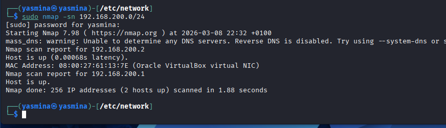
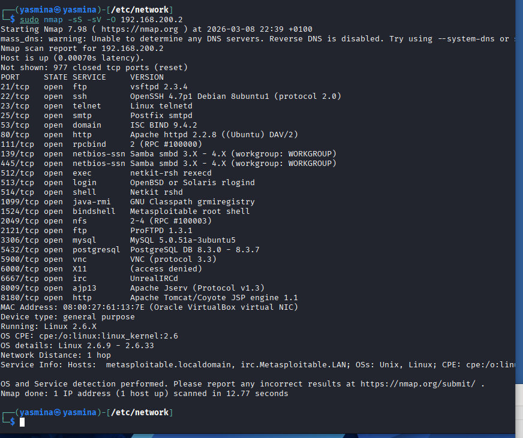

# Scan du réseau et récupération de l’adresse IP

Maintenant qu’on a terminé de préparer les machines, on va pouvoir commencer donc déjà la première chose à faire, on va partir du principe qu’on ne connaît ni le login ni le mot de passe ni l’adresse IP de la machine cible.

Donc pour commencer il va falloir trouver le point de départ, c’est de trouver l’IP de la victime.

On va donc chercher dans le réseau parce que les deux sont dans le même réseau, on sait que le masque de sous réseau des deux adresses IP des deux machines est 192.168.200.0.

Nous ce qu’on va faire, c’est qu’on va faire un scan du réseau : avec le scan du réseau, on va pouvoir repérer quelle machine se trouve dans le réseau.

Donc en tapant la commande, juste en scannant le réseau, on met l’option `-sn` qui veut dire en fait on scanne mais pas les ports, on veut juste chercher quelles machines sont actives sur le réseau.

Et bien on nous sort bien l’IP de la machine cible. Normalement on n’est pas censé savoir, mais là il y a une machine qui ressort : ça veut dire qu’il y a une machine sur le réseau qu’on a retrouvée grâce à cette commande. Donc si on nous dit “host is up” (ou un truc du style), ça veut dire que la machine répond.

Maintenant on possède son adresse IP (dans mon cas c’est 192.168.200.2).

Maintenant qu’on a son adresse IP, on va pouvoir trouver plus de visibilité sur la machine : on va pouvoir trouver quels ports sont ouverts, quels services tournent, quelles versions des services et des logiciels.

Donc ça va être en fait la reconnaissance, la recherche des vulnérabilités.

Du coup on va reprendre notre commande Nmap, mais cette fois-ci on va faire une recherche directement sur l’adresse IP et on va y ajouter des options, on va lui ajouter “full option” pour qu’on ait toutes les infos possibles sur la machine :

- `-sS` : ça signifie un scan furtif (ça permet d’être beaucoup plus discret sur le réseau qu’un scan normal)
- `-sV` : ça signifie nous donner la version des logiciels / services
- `-O` : ça signifie donner l’OS de la machine, donc est-ce que c’est une Linux, est-ce que c’est une Windows…

Et bien sûr suivi de l’adresse IP qu’on aura trouvé, c’est-à-dire 192.168.200.2.

Et bien sûr toutes ces actions se font en `sudo` (donc en admin).

Donc voilà le scan va s’effectuer et là on va voir quoi ? On va voir tous les ports qui sont ouverts, tous les services qui y correspondent, et toutes les versions de chaque port.

Exemple pour le service FTP : donc le serveur FTP sur le port 21, on est à la version 2.3.4 (vsftpd 2.3.4). Donc ça on va explorer pareil pour toutes les autres.

Donc maintenant notre boulot ça va être quoi ? On va essayer d’exploiter une à une pour bien comprendre tous les ports différents, à quoi ils correspondent, comment les exploiter, quel type d’attaque utiliser.

Là comme c’est une machine exprès pour être victime, c’est normal qu’elle ait beaucoup de ports ouverts et qu’il y ait beaucoup de vulnérabilités à exploiter, mais c’est justement pour s’entraîner dessus.

